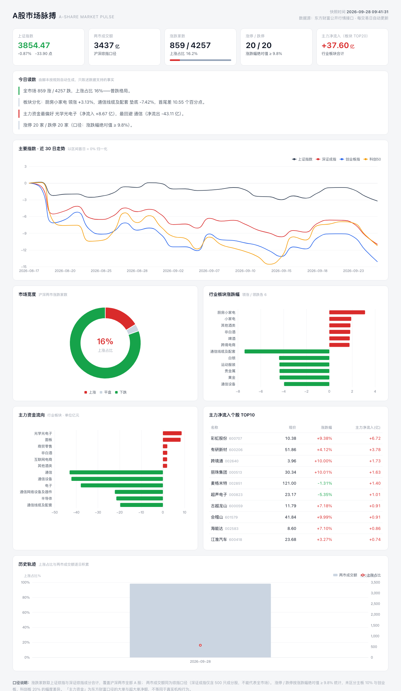

# A股市场脉搏 · A-Share Market Pulse

一个**零服务器、纯静态**的 A 股每日快照看板：抓取 → 生成洞察 → 提交数据 → 自动发布，全流程由 GitHub Actions 免费托管。



## 它做什么

每个交易日收盘后（北京时间 15:30），自动抓取东方财富公开行情接口，生成一份盘中快照：

- **主要指数**：上证 / 深成 / 创业板 / 科创50 近 30 日归一化走势
- **市场宽度**：沪深两市全部 A 股的涨跌家数与上涨占比
- **行业板块**：领涨 / 领跌 TOP6，主力资金净流入 / 净流出 TOP6
- **个股**：主力净流入 TOP10
- **今日读数**：脚本按规则把数字翻译成一句人话（含价量背离、权重护盘等提示）
- **历史轨迹**：每天的快照归档在 `docs/data/history/`，时间越久，趋势越有价值

## 快速开始

```bash
pip install -r requirements.txt
python scripts/fetch_data.py
# 打开 docs/index.html 即可（双击也行，数据通过 market.js 注入，无 CORS 问题）
```

## 部署到 GitHub Pages

1. Fork 或把本仓库推到 GitHub
2. 仓库 **Settings → Pages → Build and deployment → Source** 选择 **GitHub Actions**
3. 完成。工作流会在每交易日 15:30（北京时间）自动抓取并重新发布

也可以随时手动触发：**Actions → daily-snapshot → Run workflow**。

## 设计取舍

| 决策 | 原因 |
| --- | --- |
| 只依赖 `requests` | 不用重型数据框架，Actions 冷启动 10 秒内跑完 |
| 数据与展示分离 | 爬虫只产出 JSON / market.js，页面永不需要重新构建 |
| `market.js` 而非 `fetch(json)` | 本地双击 `index.html` 就能看，没有 file:// 的 CORS 限制 |
| ECharts 打包进 `vendor/` | 不依赖第三方 CDN，国内访问不受影响 |
| 洞察只陈述事实 | 规则引擎只描述数据支持的现象（如背离），不做任何预测 |

## 口径说明

- 涨跌家数：上证综指 + 深证综指成分合计，覆盖两市全部 A 股
- 两市成交额：同为**综指口径**（深证成指仅 500 只成分股，不能代表全市场——这是常见的口径错误）
- 涨停 / 跌停：涨跌幅绝对值 ≥ 9.8%，未区分主板 10% 与创业板、科创板 20% 差异
- 主力资金：东方财富口径的大单 + 超大单净额，不等同于真实机构行为

**免责声明：本项目为数据可视化练习，所有数据仅供参考，不构成任何投资建议。**

## 目录结构

```
├── docs/                  # GitHub Pages 站点根目录
│   ├── index.html         # 单页看板（自包含）
│   ├── data/              # latest.json / market.js / history.json
│   │   └── history/       # 每日快照归档（YYYY-MM-DD.json）
│   └── vendor/            # 本地化的 ECharts
├── scripts/
│   └── fetch_data.py      # 抓取 + 洞察生成 + 历史归档
└── .github/workflows/
    └── daily.yml          # 交易日 15:30 自动抓取并部署
```

## License

MIT
